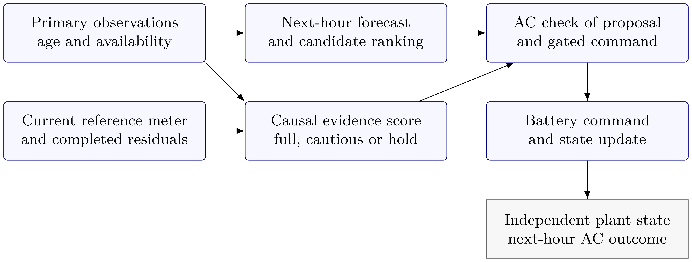
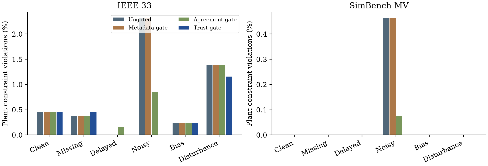

<div align="center">

# TUDT-F

### Trust-Gated Digital Twin Dispatch
**Distribution networks · Battery control · Degraded measurements**

[](https://github.com/Devchandrasen/tudt-f-smart-energy/actions/workflows/checks.yml)
[](https://www.python.org/downloads/)
[](LICENSE)
[](docs/data-provenance.md)

[Read the manuscript](manuscript/SEGAN_Manuscript.pdf) · [Reproduce the study](docs/reproduction.md) · [Inspect the results](docs/results.md) · [Understand the method](docs/methodology.md)

</div>

A reproducible research project for battery dispatch when measurements are missing,
delayed, noisy or biased. A digital twin forecasts the next operating state, checks
candidate commands against AC network constraints, and uses current and past
evidence to choose full dispatch, half-power dispatch or a hold command.

**Maintainer:** Chandrasen Pandey. The accompanying research manuscript is a draft
prepared for *Sustainable Energy, Grids and Networks*. No journal acceptance or
deployment validation is implied.



## What the project contains

| Component | Scope |
| :--- | :--- |
| Networks | IEEE 33-bus feeder and a 97-bus SimBench rural MV network |
| Controllers | Ungated, metadata gate, agreement gate and composite trust gate |
| Conditions | Clean, missing, delayed, noisy, biased and operating disturbance |
| Evaluation | Six 72-hour blocks, three measurement seeds, 62,208 controller records |
| Forecasting | Chronological random forest and jointly calibrated residual intervals |
| Validation | Saved-record checks, independent AC solves and block-level uncertainty |

## Results at a glance

| Network | Ungated violations | Trust-gated violations | Ungated cost | Trust-gated cost |
| :--- | ---: | ---: | ---: | ---: |
| IEEE 33 | 0.797% | 0.386% | EUR 5,572.26 | EUR 5,584.42 |
| SimBench MV | 0.077% | 0.000% observed | EUR 3,463.77 | EUR 3,560.47 |

Violation rates cover all evaluated hours, including holds. Costs are mean
energy-adjusted costs per 72-hour block, with equal weighting across conditions
and seeds. The trust gate authorises 88.99% of evaluated epochs. Zero observed
violations is a finite-sample result.

The reduction in average violations comes with higher cost. Agreement alone
gives lower selective risk at matched coverage in the fixed-proposal comparison.
Missing-data performance on the IEEE feeder also worsens slightly under the trust
gate. These findings are retained in the paper and [result guide](docs/results.md).



## Start in three commands

Use **Python 3.12**, clone the repository, and activate an isolated environment.
The pinned versions define the tested installation environment.

```bash
git clone https://github.com/Devchandrasen/tudt-f-smart-energy.git
cd tudt-f-smart-energy
python -m venv .venv
```

Activate with `.venv\Scripts\Activate.ps1` in PowerShell or
`source .venv/bin/activate` on Linux/macOS, then run:

```bash
python -m pip install -e .
python -m tudtf verify
python -m tudtf run --quick
```

The short run produces **384 records** in `results/quick/`. It checks execution;
it is smaller than the experiment reported in the manuscript. The archived study
remains in `results/reference/` and is protected against accidental overwriting.

To reproduce the full experiment and its analysis:

```bash
python -m tudtf run
python -m tudtf analyse --results results/full
python -m tudtf verify --results results/full --skip-hashes
python -m tudtf compare --results results/full
```

The same commands are available through the installed `tudtf` entry point.
See [reproduction](docs/reproduction.md) for output paths and platform notes.

## Project map

```text
src/tudtf/            Forecasting, dispatch, evidence, analysis and verification
tests/                Causality, numerical, feasibility and archive checks
results/reference/    Executed study, metadata and SHA-256 manifest
docs/                 Methodology, result interpretation and data provenance
docs/assets/          Architecture and result figures
manuscript/           PDF, editable LaTeX, figure sources and artwork
.github/workflows/    Automated tests and quick benchmark
```

Generated runs go to `results/full/` or `results/quick/`, which are ignored by Git.
The earlier OPSD implementation remains available at
[commit 94a9e83](https://github.com/Devchandrasen/tudt-f-smart-energy/tree/94a9e83).
Its metrics belong to a different experiment.

## Research boundaries

This is a simulation benchmark. Both networks use common aggregate SimBench
load and generation factors. An available independent reference meter, study
tariffs, battery placement and a specified IEEE feeder current rating are
assumptions. All observed failures concern voltage; thermal stress is not
established by these runs. The search uses discrete candidate ranking followed
by AC checks. It does not establish a global OPF optimum or a safety guarantee.

The 62,208 records share time blocks and are correlated. Confidence intervals
resample six complete blocks. The data split, gate timing and conditional regret
are explained in the [method guide](docs/methodology.md).

## Citation and reuse

Use GitHub's **Cite this repository** action or [CITATION.cff](CITATION.cff).
A paper DOI has not been assigned. Please acknowledge the original SimBench,
pandapower and IEEE feeder sources when using the benchmark.

Original project code and documentation use [MIT](LICENSE). The benchmark-derived
database retains [SimBench's ODbL and database-content terms](docs/data-provenance.md).
Manuscript and artwork rights are described in [NOTICE](NOTICE).

Contributions and reproducibility reports are welcome through
[issues](https://github.com/Devchandrasen/tudt-f-smart-energy/issues).
Read [CONTRIBUTING.md](CONTRIBUTING.md) before changing the study or reference results.
