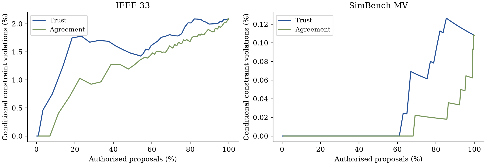

# Results and interpretation

The result tables come from executed benchmark simulations. The archived record
contains 62,208 controller decisions, not independent field trials. Rates include
all hours; authorisation and nonzero dispatch are separate quantities.

## Main comparison

| Network | Controller | Physical violation rate | Authorisation | Nonzero dispatch | Mean cost per 72 h |
| :--- | :--- | ---: | ---: | ---: | ---: |
| IEEE 33 | Ungated | 0.797% | 100.00% | 38.59% | EUR 5,572.26 |
| IEEE 33 | Metadata gate | 0.797% | 81.29% | 31.47% | EUR 5,618.35 |
| IEEE 33 | Agreement gate | 0.579% | 81.07% | 33.38% | EUR 5,580.72 |
| IEEE 33 | Trust gate | 0.386% | 88.99% | 41.01% | EUR 5,584.42 |
| SimBench MV | Ungated | 0.077% | 100.00% | 18.36% | EUR 3,463.77 |
| SimBench MV | Metadata gate | 0.077% | 81.29% | 15.14% | EUR 3,640.64 |
| SimBench MV | Agreement gate | 0.013% | 81.07% | 16.04% | EUR 3,523.83 |
| SimBench MV | Trust gate | 0.000% observed | 88.99% | 19.62% | EUR 3,560.47 |

Source: [overall_results.csv](../results/reference/overall_results.csv).
Cost increases by EUR 12.17 on IEEE 33 and EUR 96.70 on SimBench per block.
These increases are about 0.22% and 2.79%. Only voltage violations occur in the
evaluated states. The study cannot support a claim of thermal protection.

## Paired uncertainty

| Network | Trust minus ungated violation rate | 95% block-bootstrap interval | Cost difference | 95% interval |
| :--- | ---: | :--- | ---: | :--- |
| IEEE 33 | -0.412 percentage points | [-0.630, -0.193] | EUR 12.17 | [-2.17, 25.50] |
| SimBench MV | -0.077 percentage points | [-0.206, 0.000] | EUR 96.70 | [50.47, 137.51] |

Six clusters give limited precision. The SimBench violation interval reaches
zero. [paired_uncertainty.csv](../results/reference/paired_uncertainty.csv)
contains all reported metric differences.

## Where the gate helps and where it costs

Noise gives the clearest violation reduction. IEEE 33 noise-condition rates fall
from 2.315% ungated to zero observed under the trust gate. SimBench noise-condition
rates fall from 0.463% to zero observed. Under missing data on IEEE 33, the trust
rate is 0.463% versus 0.386% ungated. Clean-condition IEEE violations are unchanged.

Two-hour delay produces no ungated physical violations in the evaluated blocks.
Gating still raises cost in that condition. These outcomes depend on both command
scaling and the resulting battery SOC trajectory.

## Selective ranking

At matched 90%, 75% and 50% coverage, agreement alone has lower selective risk
than composite trust on IEEE 33. It is lower at 90% and 75% on SimBench and ties
at 50%. The comparison uses common fixed-SOC proposals, which differs from the
controllers' evolving SOC trajectories. Full-policy violation reduction is not
evidence that the composite score ranks proposals better.

See [matched_coverage.csv](../results/reference/matched_coverage.csv) and
[score_sensitivity.csv](../results/reference/score_sensitivity.csv) for the data.

## Verification and limits

The original audit found zero SOC-bound, score-regime, physical-label or nonzero
model-feasibility failures. Forty fresh AC solves agreed with recorded results to
within 2.74e-8 maximum absolute component difference. The archive also contains
input factors and forecast-validation records.

The complete study was also rerun in the compatible installation environment
(pandapower 3.4.0 and SciPy 1.16.3). All six compared saved data tables match the
original archive within relative and absolute tolerances of 1e-8. The original
reference files retain their recorded versions. See
[reproduction_check.json](../results/reproduction_check.json) and
[project_validation.json](../results/project_validation.json).

Aggregate spatial factors, available independent references, study tariffs,
explicit battery placement and an assumed IEEE line rating limit generalisation.
Field operation, coordinated attacks, missing references, asset-specific spatial
profiles and severe thermal cases remain outside the evaluated experiment.
